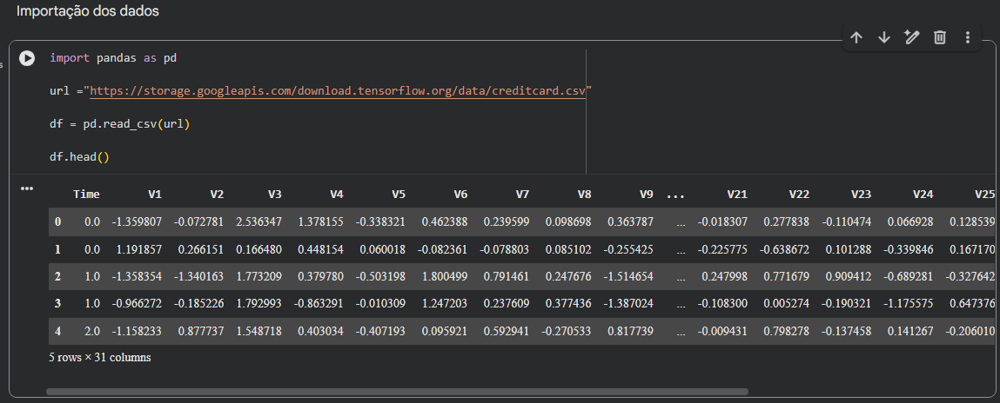
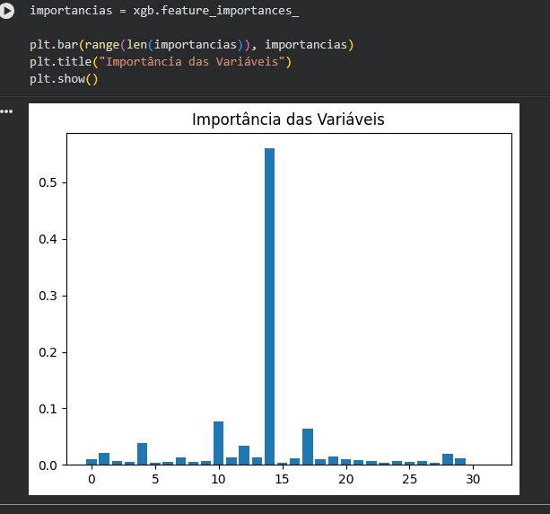
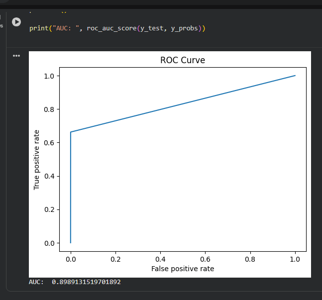
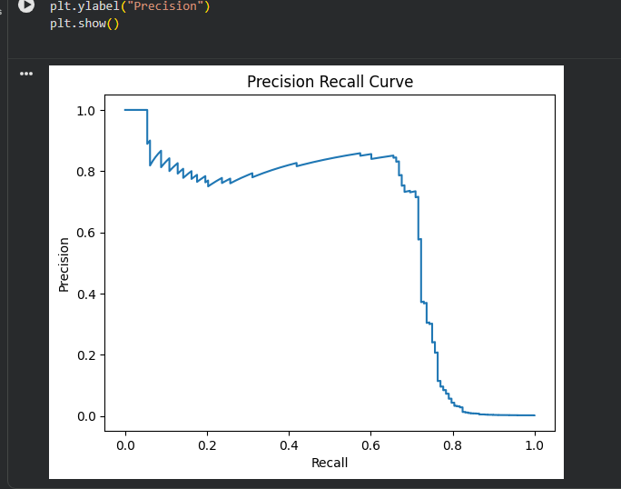
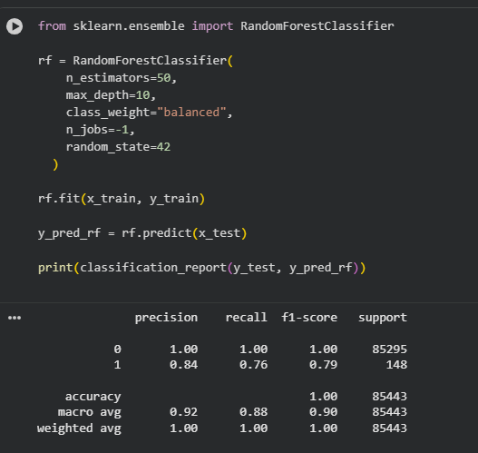
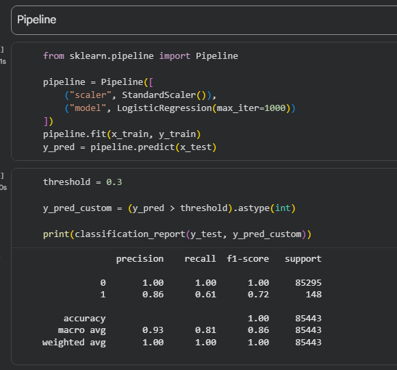
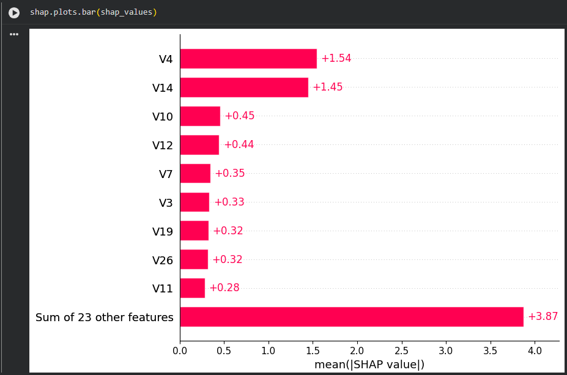

# Detecção de Fraudes com Machine Learning

Este projeto tem como objetivo aplicar técnicas de **Machine Learning** para detectar **fraudes em transações de cartão de crédito**, utilizando um dataset público altamente desbalanceado.

### Objetivo

Desenvolver e avaliar modelos de classificação capazes de identificar transações fraudulentas, abordando desafios como:

- Desbalanceamento de classes
- Engenharia de atributos (Feature Engineering)
- Avaliação com métricas adequadas
- Otimização de modelos

### Dataset

O dataset utilizado contém transações reais de cartões de crédito:

- Fonte: https://storage.googleapis.com/download.tensorflow.org/data/creditcard.csv
- Classes:
  - `0` → Transação normal
  - `1` → Fraude (classe minoritária)

O dataset é altamente desbalanceado, com uma quantidade muito menor de fraudes.

### Etapas do Projeto

1. Importação dos dados
2. Análise de desbalanceamento
3. Feature Engineering
4. Separação treino e teste
5. XGBoost (Modelo Avançado)
6. Importância das Variáveis
7. Explicabilidade (SHAP)



### Principais Métricas

```
Para este problema, as mais importantes são:
Recall (Sensibilidade) → detectar fraudes
Precision → evitar falsos positivos
F1-score → equilíbrio geral
AUC-ROC
```

### Desafios do Projeto

```
Dataset altamente desbalanceado
Modelos tendem a prever “não fraude”
Necessidade de ajustar métricas e técnicas de balanceamento
```



### Tecnologias Utilizadas

```
Python
Pandas
NumPy
Scikit-learn
XGBoost
Matplotlib
SHAP
Imbalanced-learn (SMOTE)
```





### Aprendizados: Este projeto demonstra na prática:

```
Como lidar com dados desbalanceados
Diferença entre métricas (accuracy vs recall)
Importância de feature engineering
Automação - Pipeline
Uso de modelos avançados como XGBoost
Técnicas de explicabilidade (SHAP)
```







---

### Conclusão: Modelos simples como regressão logística não são suficientes para problemas de fraude.

Técnicas como: Balanceamento de dados, modelos mais robustos e ajuste de hiperparâmetros, são essenciais para melhorar a detecção.
